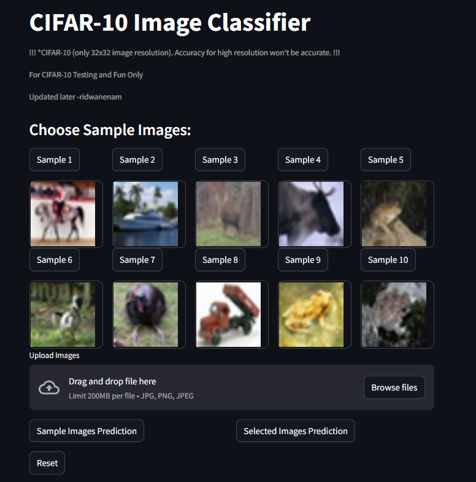

# 🚀 Deployable MobileNetV2 on CIFAR-10 (CUDA + Streamlit)

Project using **MobileNetV2** model trained on the **CIFAR-10** dataset, and deployed with **Streamlit Cloud**.

---

## 🌐 Live Demo

👉 [Click here to try the app on Streamlit!](https://deployable-mobilenetv2-on-cifar-10-v1.streamlit.app/)  
⚡ *Real-time inference, clean UI, fully deployed on the cloud.*

---

## 🌐 Preview

---

## 🧠 About the Project

| Feature                     | Description                                            |
|-----------------------------|--------------------------------------------------------|
| 📦 Dataset                 | CIFAR-10 (10 classes, 60k images, 32x32 resolution)    |
| 🧠 Model                   | MobileNetV2 (Pretrained)                               |
| ⚙️ Framework               | PyTorch, Torchvision                                   |
| 💻 Deployment              | Streamlit Cloud                                        |
| 🧪 Input                   | JPG/PNG image upload or choose from 10 sample images   |
| 🚀 Output                  | Class prediction with confidence score + top-3 results |
| 🔥 Acceleration            | Trained using CUDA (NVIDIA RTX 2060)                   |

---

## 📸 Sample Classes in CIFAR-10

> `['airplane', 'automobile', 'bird', 'cat', 'deer', 'dog', 'frog', 'horse', 'ship', 'truck']`
> 
The model is optimized for simple object recognition across these classes.

---

## 📷 App Features

- ✅ Upload your own image (JPG/PNG)
- 🖼️ Choose from 10 curated sample images
- 🔍 Get predictions and confidence scores
- 🔢 See top-3 predicted classes
- ⚠️ Accuracy warning if model confidence < 50%
- 🧼 Reset feature to try again

---

